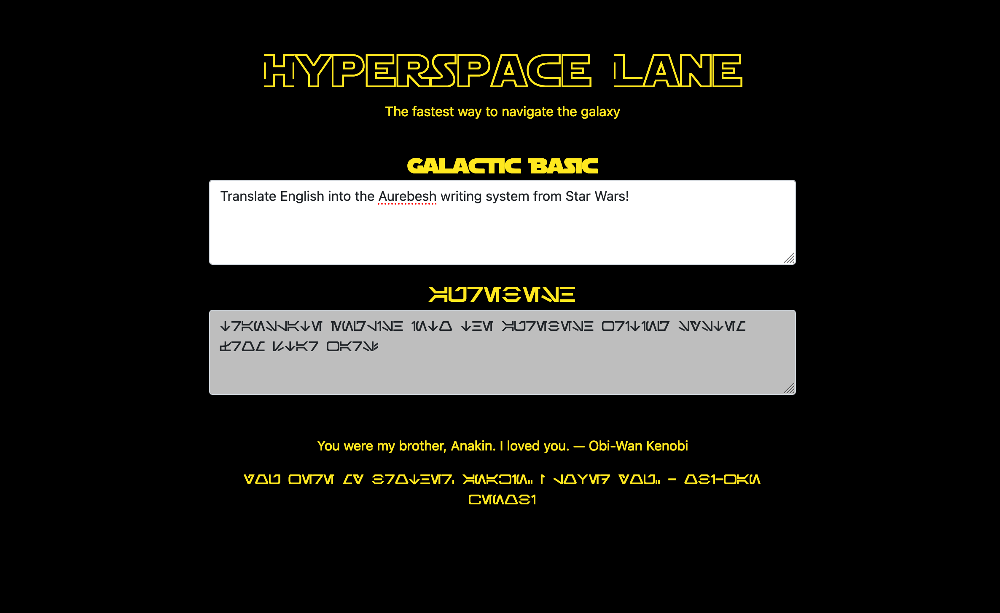

# **Hyperspace Lane**

---

## **Description**

Hyperspace Lane provides its users with the fastest way to navigate the galaxy. Use it to translate Galactic Basic (English) into Aurebesh (Star Wars writing system)!

---

## **Table of Contents**

1. [Technologies](#Technologies)
2. [Screenshots](#Screenshots)
3. [Installation](#Installation)
4. [License](#License)
5. [Contributions](#Contributions)
6. [Questions](#Questions)
7. [Author](#Author)

---

## **Technologies**

- HTML/CSS
- Javascript
- Node.js
- Express.js
- jQuery
- Star Wars Quotes API
- Bootstrap (CSS Framework)
- Handlebars (View Engine)
- Heroku Deployment
- Cors-anywhere

---

## **Screenshots**

---

## **Installation**

1. Clone the repo: `git clone https://github.com/jallan07/hyperspace-lane.git`
2. Install NPM packages: `npm i`

   ***

---

## **License**

Distributed under the MIT License.

---

## **Contributions**

**Current Contributors:**

_Josh Allan_

Contributions are what make the open source community such an amazing place to be learn, inspire, and create. Any contributions you make are greatly appreciated.

1. Fork the Project
2. Create your Feature Branch (git checkout -b feature/AmazingFeature)
3. Commit your Changes (git commit -m 'Add some AmazingFeature')
4. Push to the Branch (git push origin feature/AmazingFeature)
5. Open a Pull Request

   ***

---

## **Questions**

The following questions exist on our end, and are currently trying to be solved:

How do I avoid cors-anywhere altogether and get around the mixed-content issue?

---

## **Author**

Below is contact information for the author of this application. Please feel free to reach out directly if additional questions exist.

- Name: Josh Allan
- Email: allan.josh07@gmail.com
- LinkedIn: https://www.linkedin.com/in/joshuamallan

---

### Thank you for using Hyperspace Lane!
